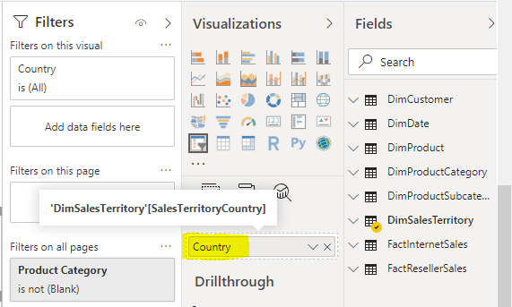

# Power BI Realistic Load Test Tool

For "realistic user scenario" load testing to simulate a realistic set of user actions such as changing slicers, changing filters, clicking bookmarks, and simulating user "think time" where a user studies the report before clicking again, use this Realistic Load Test Tool.


#### Change Log
- 8/1/2019 - Initial check-in containing the following enhancements to the original LoadTestingPowerShellTool code:
    - Support for multiple slicers/filters and support for randomly cycling through filter combinations to achieve cold cache load tests
    - Support for text and integer report-level filters
    - Support for text and integer slicers
    - Support for specifying the report page to display
    - Support for clicking through a series of bookmarks to simulate user actions
    - Support for single-select and multi-select on both slicers and report-level filters
    - Separate Update_Token_Only.ps1 script for refreshing the token without logging into Power BI again
    - Separate Run_Load_Test_Only.ps1 script to launch a load test for specified folders only
    - Launching multiple Chrome processes to ensure higher concurrency tests can be run and that 100% CPU on the client machine can be used
    - Display of client-side report refresh average duration metrics
    - Improvement to the PBIReport.JSON format to be more readable
    - Support for mobile portrait and mobile landscape layouts

## This package includes:  
- **Setup_Load_Test.ps1** (starting point) - Interactively prompts for sign into Power BI, lets the user choose the workspace and report to load test, and creates a subfolder or subfolders with the partially configured load test.
- **Update_Token_Only.ps1** - Since the AAD token expires every 60 minutes this script retrieves a new token and updates the PBIToken.JSON files in all subdirectories of the current folder.
- **Run_Load_Test_Only.ps1** - A script to start the load test for the subdirectories you specify (or all subdirectories if not specified).
- **PBIToken.JSON** (JS Object File) file which stores AAD access token for the connections to work. You will refresh this token by running Update_Token_Only.ps1
- **PBIReport.JSON** (JS Object File) file which stores report parameters including report url, filter parameters. 
- **RealisticLoadTest.html** - Uses PBIToken.JSON file to get the access token, PBIReport.JSON to get the report load test configuration and then renders the report. It cycles through the filter/slicer combinations in random order and cycles through each bookmark for each filter combination until you stop the load test by manually closing Chrome windows (or by clicking Enter at the prompt in the Run_Load_Test_Only.ps1 script).

### Prereqs:
- This package requires an elevated PowerShell console to run. (i.e. "Run As Administrator") 
- This package contains an unsigned PowerShell script. You must first use Set-ExecutionPolicy Unrestricted command in order to allow running of unsigned scripts.
- This package requires the "MicrosoftPowerBIMgmt" Power BI PowerShell modules to be installed from [here](https://docs.microsoft.com/en-us/powershell/power-bi/overview?view=powerbi-ps).

### Description:

- This package is designed to measure the refresh performance under a realistic load test simulating multiple users changing filters or slicers and clicking Bookmarks. It can be used to test the scalability of a report, the scalability of Power BI Premium capacity, and the scalability of backend DirectQuery or Live Connect data sources. 
- The tool is meant to be used in capacity planning and scale evaluation scenarios, when admins of Power BI capacities and backend data sources wish to test the ability of their architecture to serve a certain scale.
- While the tool will display average report render time metrics in the Chrome browser window, it is recommended you monitor the [Premium Capacity Metrics app](https://docs.microsoft.com/en-us/power-bi/service-admin-premium-monitor-capacity) to analyze the results of the load test in this app. It is also recommended you monitor any servers or services which are used in DirectQuery or LiveConnect reports.
- The Setup_Load_Test.ps1 script will prompt users for Power BI credentials and prompt for a list of workspaces and reports. The tool will assist in setting up load tests using Power BI Embed tokens. The RealisticLoadTest.html file utilizes the Power BI JavaScript API to orchestrate the load test.
- The reports to test must be deployed to a group workspace, not to My Workspace. The user need not be a workspace admin.
- For each report, the tool will ask the user how many browser windows should hit that report simultaneously.
- Once launched, the tool will open new Chrome windows for each instance. i.e. if report 1 had 4 simultaneous renders requested, the tool will open 4 separate windows of Chrome (not Tabs).
- We recommend to monitor the CPU on the client machine and lower the number of requested browser windows you specify to the Run_Load_Test_Only.ps1 script if necessary. If client machine CPU is consistently at 100% then the average refresh time metrics in the browser will be inaccurate and the load test will not be valid. Depending on the complexity of the report, we recommend approximately one browser window per physical core. So if you are running a load test with two subdirectories (two reports) and your client machine has 8 physical cores, then specify 4 windows per report for a total of 8 windows.
- If more concurrency is needed than a single client machine can support we recommend running this load test in parallel on multiple client machines. Running the load test over remote desktop to an Azure virtual machine with a sufficient number of cores works well. We also recommend lowering the thinkTimeSeconds configuration to 0 or 1 second. To calculate the equivalent simulated users count sum the average report refresh time with the assumed real user think time, then divide by the average report refresh time. For example, if the browser window reports an average of 10 seconds to refresh the report with a 0 seconds think time and you assume a real user will spend approximately 30 seconds studying the report before clicking again, then (10+30)/10 = 4. The load test you just ran simulated 4 "real world users per window".
- Users should always keep the Chrome windows open and in the viewport, otherwise the OS management of the browser client interacting with Power BI will reduce the load the test is generating

### PBIReport.JSON Configuration Options

Study the DemoLoadTest1/PBIReport.JSON and DemoLoadTest2/PBIReport.JSON files for examples of configuring the load test. After running Setup_Load_Test.ps1, one or more subfolders are created with a PBIReport.JSON file which contains the report's embed URL along with some basic settings. Edit this file in a text editor to setup filters, slicers, bookmarks, page navigation, etc. To test these load tests, deploy "Power BI Load Testing Demo.pbix" to your Power BI tenant then run Setup_Load_Test.ps1 to setup a new folder for your deployed version of this report. Then edit the PBIReport.JSON file and overwrite all parts of the file except the reportUrl (which is specific to your Power BI deployed report) using the sample PBIReport.JSON files in the DemoLoadTest1 and DemoLoadTest2 folders.

DemoLoadTest1 contains the following example:

```
reportParameters={
	"reportUrl":"https://app.powerbi.com/reportEmbed?reportId=36621bde-4614-40df-8e08-79481d767bcb&groupId=dfbfe8ab-b93b-4345-8a43-655697ff36dd&w=2&config=eyJjbHVzdGVyVXJsIjoiaHR0cHM6Ly9XQUJJLVVTLU5PUlRILUNFTlRSQUwtcmVkaXJlY3QuYW5hbHlzaXMud2luZG93cy5uZXQifQ%3d%3d",
	"pageName": "",
	"bookmarkList": ["Bookmark1d7f5476b91147a87955","Bookmark6a5ec58ce57e4f389ce5"],
	"sessionRestart":100,
	"filters": [
		{
			"filterTable":"DimProductCategory",
			"filterColumn":"Product Category",
			"isSlicer":true,
			"filtersList":["Accessories","Bikes","Clothing"]
		},
		{
			"filterTable":"DimSalesTerritory",
			"filterColumn":"SalesTerritoryCountry",
			"isSlicer":true,
			"filtersList":[
				"United States",
				"France",
				["Australia","Canada","United Kingdom","United States"],
				["France","Germany"]
			]
		},
		{
			"filterTable":"DimDate",
			"filterColumn":"Quarter",
			"isSlicer":false,
			"filtersList":["Q1","Q2","Q3","Q4"]
		}
	],
	"thinkTimeSeconds":1
 };
```

Note this is JavaScript (the file begins with "reportParameters=" because we are assigning the JSON object notation to that variable.)

- **reportUrl** should not change. This is populated by Setup_Load_Test.ps1. This identifies which report to run.
- **pageName** allows the load test to render a particular page which is not the default. To render the default page, you may set pageName to null, empty string, or omit pageName entirely. This is not the page (tab) name visible in Power BI. This is an internal page ID which can be extracted by browsing the report in the Power BI Service and clicking to that page. The browser window URL should end with "/reports/\<reportID\>/**ReportSectiond1b63329887eb2e20791**" and ReportSectiond1b63329887eb2e20791 would be the "pageName". Ignore anything after the `?` character in the URL.
- **bookmarkList** allows the load test to simulate user behavior by clicking through bookmarks (which are commonly used to provide interactivity to a report such as switching whether to display the report in units or currency. The bookmark name is not the visible bookmark name but the internal ID. In the Power BI service, click a bookmark then study the browser URL. The value you need will be the bookmarkGuid property such as "/reports/\<reportID>/ReportSection?bookmarkGuid=**Bookmark6a5ec58ce57e4f389ce5**"
- **filters** is an array where each item in the array is a set of filters to apply to that table/column. Each column can be used as either a slicer or a filter. The tool will create all the permutations of filters. The example above has 3 Product Category filters, 4 SalesTerritoryCountry filters, and 4 Quarter filters for a total of 3\*4\*4=48 filter combinations. It is recommended not to specify a filter from multiple columns in a table since when it creates all permutations it will create meaningless combinations of filters that will produce a report rendering with many blank metrics and unrealistic performance and load characteristics. Then the tool randomizes the filter permutations list so that each window will cycle through the filter combinations in a different order. To test "warm cache" report performance, we recommend setting up a small number of filter combinations and then letting a load test run long enough that most filter combinations have been rendered. Then run the load test again to measure warm cache performance. For cold cache performance, we recommend creating a large number of filter combinations (such as 50,000) and ensuring you do not leave the load test running long enough to exhaust the filter combinations on the current or subsequent runs.
  - _Multiselect_: The SalesTerritoryCountry filter example above specifies the first filter is single-select "United States", the second filter is "France", then the third filter is a multi-select of "Australia","Canada","United Kingdom", and "United States".
  - _Alternative multiselect notation_: Alternately you can put a null at the beginning of the list to represent selecting all the values in the rest of the list. For example, `"filtersList": [null,"Australia","Canada"]` means the first filter should be multi-select Australia + Canada, the second filter is Australia, and the third is Canada. Do not use the "null" notation in combination with multi-select (the following will not work `"filtersList": [null,"Australia","Canada",["United States","Canada"]]`)
  - _Slicers_: The notation `"isSlicer":true` indicates this filter should be a slicer rather than a report-level filter.
  - _Table and column names:_ Even if a report author has renamed the display name for a column in a visual, use the proper table and column name in the model. The easiest way to determine the name is to edit the report, click the slicer in question and mouse over the field name in the field well in the Visualizations pane. In the screenshot below, SalesTerritoryCountry is the proper column name, not Country. Ignore the single quotes around the table name and the brackets around the column name.
  
- **thinkTimeSeconds** is an integer with the number of seconds to pause before rendering the next bookmark or filter combination. We recommend while setting up a load test you set the think time to 5-10 seconds so you can visually examine the report results between each iteration. But for running a real load test to test 200 users, it is difficult to obtain hardware to spin up 200 Chrome browser windows without maxing out the CPU and distorting test results. So we recommend setting think time to 0 seconds or 1 second and using the "real world users per window" calculation mentioned above.
- **layoutType** not pictured in the example above is an extra property that allows you to specify you want a specific layout to be rendered: MobilePortrait, MobileLandscape or Master (master is the regular layout). Use the following syntax to specify mobile portrait view, for example: `"layoutType": "MobilePortrait"`

##### Troubleshooting:
- After setting up PBIReport.JSON in the report subfolder we recommend manually double clicking the RealisticLoadTest.html in that report subdirectory to test the report. If the report does not load or the load test does not function as expected check the following items:
  - Run the Update_Token_Only.ps1 script to ensure you have a fresh token in each subdirectory.
  - Press F12 in the Chrome browser window and then look for a little red X in the top right next to a number showing the number of JavaScript errors on the page. Click that red X and investigate the error messages.

##### Notes:
- By default, the AAD access token expires in 60 minutes. Reports will run for up to 60 minutes and stop with an error once the access token expires. Run Update_Token_Only.ps1 to refresh the token.

###### Initial version of HTML report file has been designed and implemented by [Sergei Gundorov](https://github.com/sergeig888). Realistic Load Test Tool enhancements were implemented by [Artis Consulting](https://www.artisconsulting.com/).
